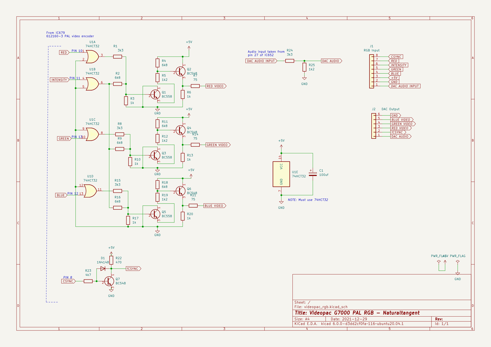

# Videopac G7000 RGB Video

This is a PCB providing RGB video output for a PAL VideoPac G7000.

Created using kicad 6.0.0

_Note: This is untested - I'm waiting for PCBs to arrive..._

## Schematic

The schematic is copied from https://gamesx.com/wiki/doku.php?id=av:g7000_av

## PCB

The PCB measures 80mm X 40.6mm.

